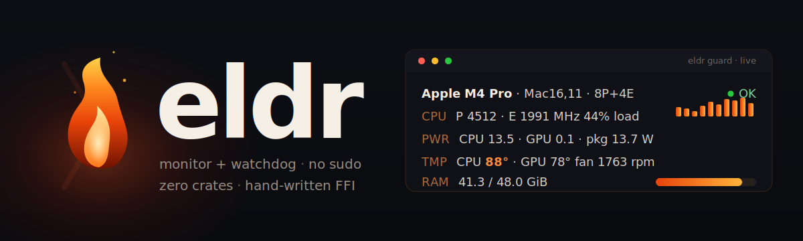
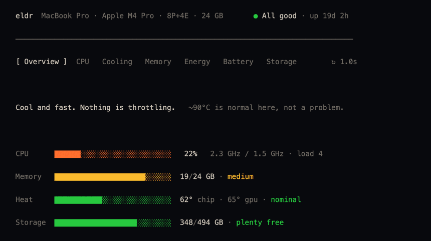

<p align="center">
  
</p>

<p align="center">
  <a href="https://github.com/Arakiss/eldr/actions/workflows/ci.yml"></a>
  <a href="https://github.com/Arakiss/eldr/releases/latest"></a>
  <a href="LICENSE"></a>
  <a href="Cargo.toml"></a>
  
  
  
</p>

# eldr

> _eldr_ — Old Norse for **fire**.

**A global hardware monitor and protective watchdog for Apple Silicon Macs.** No sudo,
no external crates — every OS interface is hand-written FFI over the system frameworks.
It reads CPU/GPU/ANE power, per-core load, temperatures and fans the same no-sudo way
Apple's own tools do, and — when armed — takes **reversible** action on a sustained
thermal anomaly.

<p align="center">
  
</p>

<p align="center"><sub><code>eldr tui</code> — seven tabbed live views. Below is <code>eldr now</code>, the one-shot snapshot:</sub></p>

```
  eldr  Apple M4 Pro (Mac16,11)  8P+4E · 16 GPU   OK (live)
  CPU   P 4512 · E 1991 MHz    44% load ·  43% busy   ▃▃▂▂▄▃▃▃▆▆▆▆
  GPU    338 MHz     4% busy
  Pwr   CPU 13.5 · GPU  0.1 · ANE  0.0 · pkg 13.7 · sys 35.4 W
  Tmp   CPU 88°C · GPU 78°C   fan 1763 rpm (1000–4900)   thermal nominal
  RAM    41.3 / 48.0 GiB  ███████████████░░░  86%
  Dsk   Macintosh HD 443.6 GiB/460.4 GiB · Vault 39.4 GiB/3.7 TiB   net ↓13 KB/s ↑46 KB/s
  Top   com.apple.Virtualization 6%  cmux 1%  eldr 1%
```

> **Status:** early but real (`v0.5.0`). Every reading above is cross-checked against an
> independent reference monitor on an M4 Pro — frequency tables are byte-exact, live
> power/temps near-identical. It is a personal tool first; treat it as beta, and keep the
> watchdog's reversible actions disabled until you trust them on your own machine.

## Why eldr, not just another monitor

Tools like `stats` and iStat Menus are excellent at *showing* you what your Mac is doing.
eldr's two differences:

- **It can act, not only watch.** When armed, the guard takes _reversible_ protective
  action on a sustained thermal anomaly — pause a runaway agent, `SIGSTOP` the top CPU hog
  (auto-resumed), `git stash create` a dirty repo. It never kills, never shuts down, never
  closes a session. A monitor that doubles as a safety net.
- **Zero crates, by policy.** The whole binary is `std` plus FFI eldr writes itself —
  nothing under `[dependencies]`, one package in `Cargo.lock`. Small surface, fast builds,
  no supply chain to trust. CI re-checks the invariant on every push.

And it's built for agents as much as people: `eldr check` exits `0`/`1`/`2` for OK/WARN/ALERT,
and `status.json` is a stable contract for tooling.

## Why zero crates

The whole binary builds from `std` plus `extern "C"` declarations eldr writes itself.
There is nothing under `[dependencies]` in `Cargo.toml`, and `Cargo.lock` lists exactly
one package: `eldr`. No `sysinfo`, `ratatui`, `clap`, `serde`, `chrono`, `libc`,
`core-foundation`. The data sources, the JSON emitter, the arg parser, the TUI engine
and the config reader are all hand-rolled. CI re-checks the invariant on every push.

The readings come from the same no-sudo path Apple's own tools use, through bindings
eldr writes itself (FFI provenance and acknowledgements in [NOTICE](NOTICE)):

- **IOReport** (private framework) for package/CPU/GPU/ANE power and per-cluster
  frequency residencies.
- **IOHID / SMC** for temperatures (`Tp`/`Te`/`Tg` float sensors, IOHID fallback) and
  fan RPM (`F0Ac`, envelope `F0Mn`/`F0Mx`).
- **mach / sysctl / libproc** for per-core load, RAM/swap, disk, network and the top
  processes.
- **IOKit block storage** for every mounted volume and per-disk I/O error/retry/latency
  counters, plus **NVMe SMART** (temperature, wear, bytes written, spare) through the
  `IONVMeSMARTInterface` plug-in — for the internal SSD and external Thunderbolt-NVMe
  disks alike.
- **NSProcessInfo** thermal state via the bare Objective-C runtime — the clean throttle
  signal the watchdog gates on.

The IOReport/IOHID/SMC FFI is hand-written from Apple's framework interfaces: eldr
declares every binding itself and depends on nothing. Reference material studied while
re-deriving it is acknowledged in [NOTICE](NOTICE).

## Install

### Homebrew

```sh
brew install Arakiss/tap/eldr
```

Builds from source (needs the Rust toolchain). Installs just the `eldr` CLI; for the guard
daemon's `Eldr.app` bundle, use `make install` below.

### From source

```sh
make install          # builds release, installs the CLI to ~/.local/bin, and builds Eldr.app
```

Requires a recent Rust toolchain (edition 2024, rustc 1.85+) and an Apple Silicon Mac.
`make install` also assembles `~/Applications/Eldr.app`, the bundle the guard daemon runs
from — so it appears with the eldr icon under *System Settings → Login Items*.

## Commands

```
eldr now                     one-shot snapshot
eldr check                   terse line + exit 0/1/2 (OK/WARN/ALERT) — for agents
eldr status                  panel (live, or the last guard sample)
eldr tui [--interval N]      tabbed live dashboard — Overview/CPU/Cooling/Memory/Energy/Battery/Storage
                             (←→/Tab/1-7 switch views, space pause, +/- speed, ? help)
eldr system                  machine identity: model, serial, macOS, CPU, RAM, SSD
eldr sensors                 every SMC sensor — temps, fans, power, current, voltage
eldr disk                    per-volume usage + per-disk health (SMART, I/O errors, NVMe wear)

eldr scrub init <path>       fingerprint a tree (SHA-256) into a manifest
eldr scrub verify <path>     re-hash; report bit rot, edits, new/missing (--notify to alert)
eldr scrub status [path]     manifest summary

eldr guard [--interval N]    background monitor -> status.json, alerts, interventions
eldr guard-stop              stop a running guard
eldr guard-install           run the guard 24/7 via launchd (start at login, restart on crash)
eldr guard-uninstall         remove the launchd agent
eldr watchdog-test           dry-run: show exactly what an intervention would do

eldr bench <label> [opts]    controlled load -> steady state  (--dur N --interval N --cmd "...")
eldr report <label>          steady-state summary  (--tail N)
eldr compare <a> <b>         iso-load delta + verdict  (--tail N)
```

Agents read `~/.local/share/eldr/status.json` (override the directory with `ELDR_DIR`).
`eldr check` exits `0`/`1`/`2` for OK/WARN/ALERT.

## Run it 24/7 (the guard daemon)

```sh
eldr guard-install      # writes a launchd agent (com.petruarakiss.eldr.guard) and starts it
eldr guard-uninstall    # stops and removes it
```

`guard-install` registers a per-user LaunchAgent with `RunAtLoad` + `KeepAlive`: it
starts at login, restarts on crash, and refreshes `status.json` every 30s. It runs from
`Eldr.app` when present, so the guard shows the eldr icon in Login Items. Nothing needs
`sudo`, and the agent runs entirely inside your own user session.

## The watchdog

The guard refreshes `status.json` and, when armed, can take **reversible** action on a
sustained thermal anomaly. The safety model is the point:

- Every action is reversible: Escape to a cmux surface (pauses generation), `SIGSTOP`
  with an automatic `SIGCONT` on recovery, and `git stash create` (a non-destructive
  snapshot of a dirty repo). It never kills, never shuts down, never closes a session.
- A single bad reading cannot fire it: interventions need `ELDR_CONFIRM` consecutive
  critical samples (thermal critical, or a stopped fan).
- A denylist protects this process, running agents, and core system processes from
  being suspended.
- Agents are only ever notified, never sent a prompt they would execute.
- `ELDR_DRYRUN=1` logs intended actions and performs nothing; `eldr watchdog-test`
  previews targeting at any time.

Arming lives in `~/.config/eldr/config.toml` (flat `KEY=value`):

```
ELDR_CMUX=1          # passive badge + notification into cmux workspaces
ELDR_INTERRUPT=0     # Escape to agent surfaces
ELDR_CHECKPOINT=0    # git stash-create dirty agent repos
ELDR_SUSPEND=0       # SIGSTOP the top non-protected CPU hog (auto-SIGCONT)
ELDR_CONFIRM=3       # consecutive critical samples before acting
ELDR_DRYRUN=0        # 1 = log only, perform nothing
```

## Storage health & integrity

`eldr disk` shows every mounted volume and the health of each physical disk — the
firmware SMART verdict, I/O error/retry counts, and NVMe wear telemetry where the disk
exposes it (internal SSD and external Thunderbolt-NVMe alike):

```
  DISKS
  disk0  APPLE SSD AP0512Z        internal · SSD · SMART verified · err 0 · retry 0 · 0.2/0.0 ms r/w
         └ temp 52°C · wear 1% · spare 100% · 45.1 TB written · 1408h on
  disk4  Samsung SSD 990 PRO 4TB  external · SSD · SMART verified · err 0 · retry 0 · 0.1/0.1 ms r/w
         └ temp 58°C · wear 0% · spare 100% · 0.1 TB written · 2h on
```

When the guard is running it watches this passively: it **notifies** (never intervenes on
a disk) when SMART flips to failing, I/O errors start rising, or the firmware raises an
NVMe critical warning. `eldr disk` exits `2` on a failing disk, `1` on I/O errors.

The **scrubber** catches what SMART can't — silent corruption (bit rot), a flipped bit on
disk that nothing reports. APFS checksums its own metadata, not your file data, so the
only honest detector is to hash the bytes and compare:

```sh
eldr scrub init   /Volumes/Vault      # fingerprint the tree (SHA-256) into a manifest
eldr scrub verify /Volumes/Vault      # re-hash; report bit rot, edits, new and missing
```

The tell of true corruption versus a normal edit: the content changed while size **and**
modification time stayed identical. `verify` exits `2` and keeps flagging a corrupt file
until it's restored. For a scheduled scrub, `eldr scrub verify <path> --notify` raises a
notification and logs to `alerts.log` on corruption (run it from launchd/cron — it stays
out of the guard's sampling loop, where hashing gigabytes would stall telemetry).

## Bench discipline

A passive baseline is confounded by ambient drift and unmatched load. To measure whether
(say) a case traps heat, run two matched loads back-to-back the same day in the same room
and compare their steady state:

```sh
eldr bench bare  --dur 1200
eldr bench case  --dur 1200
eldr compare bare case
```

## The name

`eldr` is Old Norse for **fire** — the root of Swedish _eld_, Norwegian/Danish _ild_ and
Icelandic _eldur_. A small tool that watches the heat, named for the heat. The flame in
the logo is the whole brand; its runic cousin is _Kenaz_ (ᚲ), the torch.

## proto/

`proto/` keeps the original `fanwatch` bash tool that eldr grew from — the proven
watchdog safety model, the SMC keys, the cmux recipe and the `thermalstate.swift` helper.
It is the prototype and the spec, not part of the build.

## License

MIT — see [LICENSE](LICENSE). Copyright © 2026 Petru Arakiss.
